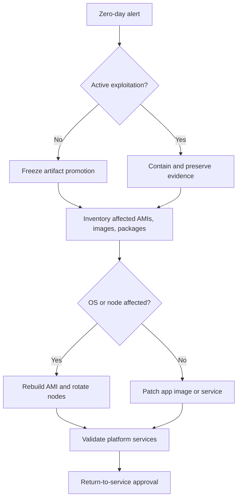

# AWS Cloud Support Plan for AI Data Application Teams

Version: 2026-07-05  
Audience: AWS Cloud Support, Cloud SRE, Data Platform, Security, and Application Teams  
Assumption: Private/internal-only AWS environment with no direct internet egress. All packages, AMIs, container images, model files, plugins, and open-source dependencies must come from approved internal repositories or mirrors.

## Current Version Anchors

Use these as starting baselines, then confirm against your organization's approved catalog before production:

| Area | 2026 guidance | Source |
|---|---|---|
| EKS Kubernetes | EKS standard support currently includes Kubernetes `1.33`, `1.34`, `1.35`, and `1.36`; extended support includes older supported versions. | [Amazon EKS Kubernetes version lifecycle](https://docs.aws.amazon.com/eks/latest/userguide/kubernetes-versions.html) |
| EKS node OS | Prefer AL2023 or Bottlerocket for new/rotated EKS nodes. EKS stopped publishing AL2 optimized AMIs after Nov. 26, 2025. | [EKS AL2 transition guide](https://docs.aws.amazon.com/eks/latest/userguide/eks-ami-deprecation-faqs.html) |
| EKS workload AWS access | Prefer EKS Pod Identity for new workload-to-AWS permissions; IRSA remains valid where already standardized. | [EKS Pod Identities](https://docs.aws.amazon.com/eks/latest/userguide/pod-identities.html) |
| Kafka/MSK | MSK supports Kafka `4.1.x`, `4.0.x`, and `3.9.x`; AWS marks `3.9.x` recommended in its supported versions table. | [Amazon MSK supported Kafka versions](https://docs.aws.amazon.com/msk/latest/developerguide/supported-kafka-versions.html) |
| OpenSearch | OpenSearch `3.7.0` was released June 2026; validate Amazon OpenSearch Service support separately before creating managed domains. | [OpenSearch version history](https://docs.opensearch.org/latest/version-history/) |
| NiFi | Apache NiFi `2.10.0` is available in Apache downloads as of June 2026; validate plugins and migration notes before upgrade. | [Apache NiFi downloads](https://downloads.apache.org/nifi/) |
| Keycloak | Keycloak `26.6.3` is a June 2026 release with multiple security fixes; patch quickly after validation. | [Keycloak 26.6.3 release](https://www.keycloak.org/2026/06/keycloak-2663-released) |
| Terraform | HashiCorp release index lists Terraform `1.15.7` as latest stable and `1.16.0-alpha` as pre-release. | [Terraform releases](https://releases.hashicorp.com/terraform/) |

## Mission

The Cloud Support Team owns the secure base cloud platform so the AI Data Application Team can run Kafka, OpenSearch, NiFi, Postgres, Keycloak, AI model servers, and agent workloads safely. The support mission is:

- Keep internal-only infrastructure available, patched, observable, and cost-controlled.
- Provide approved AMIs, EKS node groups, network paths, IAM roles, RBAC mappings, and artifact mirrors.
- Give data teams safe self-service patterns without giving them uncontrolled AWS access.
- Detect and fix problems quickly using repeatable commands, logs, metrics, and evidence collection.
- Keep production changes auditable and reversible.

## Operating Model

### Team Ownership

| Capability | Cloud Support owns | Data/App Team owns | Shared control |
|---|---|---|---|
| VPC, subnets, route tables, NACLs, VPC endpoints | Design, creation, guardrails | Connectivity requests | Firewall/security group rules |
| Base AMIs | Build, patch, scan, publish | Runtime requirements | Validation and rollback |
| EKS clusters | Control plane, node groups, add-ons, upgrades | Namespaces, workloads | RBAC, quotas, taints/tolerations |
| Internal repositories | ECR, package mirrors, model artifact stores | App image requests | Promotion and signing |
| Kafka/OpenSearch/NiFi/Postgres | Managed service or platform runtime | Topics, flows, schemas, app config | Capacity, backup, recovery |
| Keycloak | Platform deployment, HA, backups, realm guardrails | Client requests, roles | SSO and RBAC mappings |
| Monitoring | Dashboards, alarms, logs, retention | App metrics and runbooks | SLOs and escalation |
| Cost controls | Budgets, tags, quotas, reports | Workload sizing | Right-sizing and showback |

### Environment Stages

1. **Zero day**: Build the foundation before any app team deploys.
2. **Day-to-day**: Health checks, tickets, access, troubleshooting, small changes.
3. **Periodic**: Patch cycles, upgrade windows, DR tests, access reviews, cost reviews.
4. **Emergency/zero-day security**: Freeze, assess, patch, rotate, rebuild, validate, report.

## Task Outline

### Zero-Day Foundation Tasks

| Category | Tasks |
|---|---|
| Governance | Accounts, SCPs, naming, tags, budget alarms, change process, break-glass roles |
| Networking | Private VPCs, private subnets, route tables, DNS, Transit Gateway/corporate routing, no public IP policy |
| Private AWS access | VPC endpoints for EKS, ECR API, ECR DKR, S3, STS, CloudWatch Logs, SSM, EC2, KMS, Secrets Manager |
| AMIs | AL2023 or Bottlerocket baseline, CIS/STIG alignment, internal repos, SSM agent, CloudWatch agent, EDR, approved CA certs |
| EKS | Private endpoint, managed node groups, add-ons, Pod Identity/IRSA, RBAC, namespaces, quotas, network policies |
| Repositories | ECR private repos, internal RPM/DNF mirror, Maven/NPM/PyPI mirrors, model artifact repository |
| Security | KMS keys, Secrets Manager, ACM private CA or internal cert path, CloudTrail, Config, GuardDuty/Security Hub if approved |
| Observability | CloudWatch, Prometheus/Grafana if approved, Fluent Bit/OpenTelemetry, log retention, dashboards |
| Data services | Kafka/MSK, OpenSearch, NiFi, Postgres/RDS, backup policy, restore test plan |
| Identity | Keycloak HA, admin events, realm backup, SAML/OIDC integration, RBAC group mapping |
| DR | Backup, restore, snapshot, cross-AZ placement, runbooks, RTO/RPO targets |

### Day-to-Day Tasks

- Triage alarms and user tickets.
- Check EKS node and pod health.
- Approve namespace, role, secret, service account, and security group requests.
- Investigate pod pending, image pull, DNS, auth, latency, and storage errors.
- Support Kafka topic, ACL, lag, partition, and broker questions.
- Support NiFi stopped processors, backpressure, controller service failures, and flow deployment.
- Support OpenSearch shard, JVM, disk, indexing, query, and access issues.
- Support Postgres connection, slow query, storage, backup, and credential issues.
- Confirm internal mirrors and ECR images are reachable.
- Review active cost alarms and obvious orphaned resources.

### Periodic Tasks

| Frequency | Activities |
|---|---|
| Weekly | Review alarms, failed jobs, cluster events, Kafka lag, NiFi queues, OpenSearch health, Postgres storage, cost anomalies |
| Biweekly | Patch non-prod AMIs/nodes, rotate non-critical node groups, test app smoke checks |
| Monthly | Patch production, review IAM/RBAC, review Keycloak clients, review costs, validate backups, prune old images |
| Quarterly | EKS version review, dependency mirror review, DR exercise, security group review, penetration findings cleanup |
| Semiannual | Major version planning for EKS, Kafka, OpenSearch, NiFi, Postgres, Keycloak, Terraform providers |
| Annual | Account/VPC architecture review, RTO/RPO test, data retention/legal hold review, tabletop incident exercise |

### Emergency / Zero-Day Security Tasks

- Open incident bridge and assign commander, scribe, cloud lead, security lead, app lead.
- Freeze artifact promotion for affected packages/images.
- Identify affected AMIs, containers, packages, libraries, Keycloak versions, and model-serving images.
- Contain by cordoning/draining nodes, blocking security group paths, disabling vulnerable clients, or scaling down workloads.
- Collect evidence before destructive action.
- Patch internal mirror, rebuild image/AMI, deploy to non-prod, then rotate production.
- Rotate credentials if exploit involves auth, tokens, session cookies, or secrets.
- Validate business flow health before closing incident.

## Prerequisites for Platform Services

### Common OS and Runtime Prerequisites

| Item | Requirement |
|---|---|
| OS | AL2023 or Bottlerocket for EKS nodes; approved Linux for EC2-based data services |
| Time | NTP/chrony to internal time source; clock skew breaks TLS, Kafka auth, and OIDC |
| DNS | Internal Route 53 private hosted zones or corporate DNS forwarding |
| CA trust | Internal root/intermediate CA installed in AMIs and containers |
| Repos | Internal DNF/RPM, Maven, NPM, PyPI, Docker/OCI, Helm, and model artifact mirrors |
| Storage | Encrypted EBS/EFS/FSx/S3 as approved; storage classes pre-created for EKS |
| Secrets | Secrets Manager, SSM Parameter Store, External Secrets, or sealed internal equivalent |
| Logging | CloudWatch agent, Fluent Bit, OpenTelemetry, or approved collector |
| Access | SSM Session Manager preferred; no direct SSH unless explicitly approved |

### Kafka Prerequisites

- Java 17 or vendor-required JDK for Kafka 4.x tooling.
- Three or more brokers across AZs for production.
- Encrypted storage and broker-to-broker TLS.
- Internal bootstrap DNS name.
- Approved ACL model and service accounts.
- Disk alarms for broker storage.
- Topic naming, retention, compaction, and partition standards.

```bash
# Validate broker endpoint from internal admin host or admin pod
nc -vz <kafka-bootstrap.internal> 9092

# List topics
kafka-topics.sh --bootstrap-server <kafka-bootstrap.internal>:9092 --list

# Check topic configuration
kafka-topics.sh --bootstrap-server <kafka-bootstrap.internal>:9092 \
  --describe --topic <topic-name>

# Check consumer lag
kafka-consumer-groups.sh --bootstrap-server <kafka-bootstrap.internal>:9092 \
  --group <consumer-group> --describe
```

### NiFi Prerequisites

- Java version approved by the NiFi release.
- Persistent volumes for flowfile, content, provenance, database, and state repositories.
- TLS certificates and keystore/truststore from internal CA.
- Sensitive properties key stored in approved secret store.
- Internal NiFi Registry or Git-backed flow promotion process.
- Controller services for Kafka, Postgres, OpenSearch, S3-compatible storage, and HTTP endpoints.

```bash
# Check NiFi pods and services
kubectl get pods,svc,pvc -n nifi -o wide

# Review NiFi logs
kubectl logs -n nifi statefulset/nifi --tail=300

# Check repository storage inside a pod
kubectl exec -n nifi nifi-0 -- df -h
kubectl exec -n nifi nifi-0 -- du -sh /opt/nifi/*repository*
```

NiFi flow checks:

```bash
# Get process group summary through NiFi API from an approved internal host
curl -sk -H "Authorization: Bearer $NIFI_TOKEN" \
  https://nifi.internal:8443/nifi-api/flow/process-groups/root/status

# Find stopped or invalid processors
curl -sk -H "Authorization: Bearer $NIFI_TOKEN" \
  https://nifi.internal:8443/nifi-api/flow/process-groups/root/status \
  | jq '.processGroupStatus.aggregateSnapshot.processorStatusSnapshots[]
        | select(.processorStatusSnapshot.runStatus!="Running")
        | {name:.processorStatusSnapshot.name,status:.processorStatusSnapshot.runStatus}'

# Check connection queues and backpressure
curl -sk -H "Authorization: Bearer $NIFI_TOKEN" \
  https://nifi.internal:8443/nifi-api/flow/process-groups/root/status \
  | jq '.processGroupStatus.aggregateSnapshot.connectionStatusSnapshots[]
        | {name:.connectionStatusSnapshot.name,
           queued:.connectionStatusSnapshot.queued,
           percentUseCount:.connectionStatusSnapshot.percentUseCount,
           percentUseBytes:.connectionStatusSnapshot.percentUseBytes}'
```

### OpenSearch Prerequisites

- VPC-only domain or self-managed cluster in private subnets.
- Fine-grained access control and restrictive access policy.
- TLS enforced.
- Dedicated master nodes for production.
- Sizing plan for hot/warm/cold data if using managed service options.
- Index template, shard, replica, and lifecycle policy standards.
- Snapshot repository and restore test.

```bash
curl -sk https://opensearch.internal/_cluster/health?pretty
curl -sk https://opensearch.internal/_cat/nodes?v
curl -sk https://opensearch.internal/_cat/indices?v
curl -sk https://opensearch.internal/_cat/shards?v
curl -sk https://opensearch.internal/_nodes/stats/jvm,fs,thread_pool?pretty
```

### Postgres Prerequisites

- RDS/Aurora preferred where approved; otherwise hardened EC2 with backups and monitoring.
- Private subnet only.
- TLS required.
- KMS encryption.
- Parameter group reviewed.
- Backup retention and point-in-time recovery.
- Connection pooler for high-volume apps.
- Slow query logging enabled.

```bash
psql "host=<postgres.internal> dbname=<db> user=<user> sslmode=require" -c "select version();"
psql "host=<postgres.internal> dbname=<db> user=<user> sslmode=require" -c \
"select state, count(*) from pg_stat_activity group by state;"
psql "host=<postgres.internal> dbname=<db> user=<user> sslmode=require" -c \
"select pid, usename, age(clock_timestamp(), query_start), wait_event_type, wait_event, query
 from pg_stat_activity
 where state <> 'idle'
 order by query_start
 limit 20;"
```

### Keycloak Prerequisites

- HA deployment across AZs.
- External Postgres database.
- TLS from internal CA.
- Admin event logging enabled.
- Realm/client export process.
- Client secrets rotation process.
- OIDC/SAML integration tested for each app.
- Kubernetes probes tuned for startup and readiness.

```bash
kubectl get pods,svc,ingress -n keycloak -o wide
kubectl logs -n keycloak deploy/keycloak --tail=300

# Export a realm during an approved maintenance operation
kubectl exec -n keycloak deploy/keycloak -- \
  /opt/keycloak/bin/kc.sh export --realm <realm> --file /tmp/<realm>-export.json
```

### AI Model and Agent Prerequisites

- Approved model artifacts with checksum and license metadata.
- Private model registry or S3 bucket with VPC endpoint access.
- GPU or accelerator node group if required.
- Taints and labels for accelerator nodes.
- Resource requests and limits for model servers and agent workers.
- Prompt/config versioning.
- Tool allowlist for agents.
- Audit logs for agent tool calls.
- Guardrail and data-loss-prevention controls where required.

```bash
kubectl get nodes -l workload=ai -o wide
kubectl describe node <gpu-node>
kubectl get pods -n ai -o wide
kubectl logs -n ai deploy/<model-server> --tail=200
kubectl rollout history deploy/<agent-service> -n ai
```

## AWS CLI Daily Support Examples

### Configure Context

```bash
export AWS_PROFILE=<profile>
export AWS_REGION=us-east-1
export CLUSTER=<cluster-name>
export VPC_ID=<vpc-id>

aws sts get-caller-identity
aws eks update-kubeconfig --region "$AWS_REGION" --name "$CLUSTER"
kubectl config current-context
```

### EKS Health

```bash
aws eks describe-cluster --name "$CLUSTER" --region "$AWS_REGION" \
  --query 'cluster.{name:name,status:status,version:version,endpointPublicAccess:resourcesVpcConfig.endpointPublicAccess,endpointPrivateAccess:resourcesVpcConfig.endpointPrivateAccess}'

aws eks list-nodegroups --cluster-name "$CLUSTER" --region "$AWS_REGION"

kubectl get nodes -o wide
kubectl get pods -A --field-selector=status.phase=Pending
kubectl get events -A --sort-by=.lastTimestamp | tail -100
kubectl top nodes
kubectl top pods -A
```

### VPC Endpoint Checks for Air-Gapped Operation

Required common endpoints:

- `com.amazonaws.<region>.eks`
- `com.amazonaws.<region>.eks-auth`
- `com.amazonaws.<region>.ecr.api`
- `com.amazonaws.<region>.ecr.dkr`
- `com.amazonaws.<region>.s3`
- `com.amazonaws.<region>.sts`
- `com.amazonaws.<region>.logs`
- `com.amazonaws.<region>.monitoring`
- `com.amazonaws.<region>.ssm`
- `com.amazonaws.<region>.ssmmessages`
- `com.amazonaws.<region>.ec2messages`
- `com.amazonaws.<region>.kms`
- `com.amazonaws.<region>.secretsmanager`

```bash
aws ec2 describe-vpc-endpoints \
  --filters "Name=vpc-id,Values=$VPC_ID" \
  --query 'VpcEndpoints[].{id:VpcEndpointId,service:ServiceName,state:State,privateDns:PrivateDnsEnabled}' \
  --region "$AWS_REGION" \
  --output table
```

### Security Group Drift Review

```bash
aws ec2 describe-security-groups \
  --filters "Name=vpc-id,Values=$VPC_ID" \
  --query 'SecurityGroups[].{GroupId:GroupId,Name:GroupName,Ingress:IpPermissions}' \
  --region "$AWS_REGION" \
  --output json > sg-review.json
```

Look for:

- `0.0.0.0/0` or `::/0` ingress.
- Ports outside approved list.
- Unused security groups.
- Cross-team references without a ticket.

### ECR Mirror and Image Digest Checks

```bash
aws ecr describe-repositories --region "$AWS_REGION"

aws ecr describe-images \
  --repository-name ai/model-server \
  --region "$AWS_REGION" \
  --query 'imageDetails[].{tags:imageTags,digest:imageDigest,pushed:imagePushedAt,scan:imageScanStatus.status}'

kubectl get pods -A -o jsonpath='{range .items[*]}{.metadata.namespace}{"/"}{.metadata.name}{" "}{range .spec.containers[*]}{.image}{" "}{end}{"\n"}{end}' \
  | sort
```

### Internal Package and Artifact Mirror Checks

Use these checks before blaming Kubernetes. In private environments, many incidents start as mirror, certificate, DNS, or token failures.

```bash
# OS package mirror
curl -I https://<internal-rpm-repo>/repo/al2023/repodata/repomd.xml
dnf clean all
dnf repolist -v
dnf makecache

# Maven mirror for Java apps, NiFi NARs, and build tooling
curl -I https://<internal-maven-repo>/repository/maven-public/

# Python mirror for AI agents and model tooling
pip config list
pip download --index-url https://<internal-pypi>/simple <package-name>==<version>

# Helm mirror
helm repo list
helm search repo <chart-name>
helm pull <internal-helm-repo>/<chart-name> --version <version>

# Model artifact store
curl -I https://<internal-artifact-repo>/<models-path>/<model-name>
aws s3 ls s3://<internal-model-bucket>/<models-path>/ --region "$AWS_REGION"
```

### Kubernetes Image Pull Smoke Test

```bash
kubectl run image-pull-test \
  --image=<account>.dkr.ecr.<region>.amazonaws.com/<repo>:<tag> \
  --restart=Never \
  -n <namespace>

kubectl get pod image-pull-test -n <namespace>
kubectl describe pod image-pull-test -n <namespace>
kubectl delete pod image-pull-test -n <namespace>
```

## Terraform Examples

### Provider and Remote State Pattern

```hcl
terraform {
  required_version = ">= 1.15.0"

  required_providers {
    aws = {
      source  = "hashicorp/aws"
      version = "~> 6.0"
    }
  }

  backend "s3" {
    bucket         = "internal-tf-state-prod"
    key            = "data-platform/eks/terraform.tfstate"
    region         = "us-east-1"
    dynamodb_table = "internal-tf-locks"
    encrypt        = true
  }
}

provider "aws" {
  region = var.aws_region

  default_tags {
    tags = {
      Environment = var.environment
      Owner       = "cloud-support"
      Platform    = "ai-data"
      ManagedBy   = "terraform"
    }
  }
}
```

### Private Subnets for Internal EKS and Data Services

```hcl
variable "vpc_id" {}
variable "private_subnet_cidrs" {
  type = map(string)
}

data "aws_availability_zones" "available" {}

resource "aws_subnet" "private" {
  for_each          = var.private_subnet_cidrs
  vpc_id            = var.vpc_id
  cidr_block        = each.value
  availability_zone = each.key

  map_public_ip_on_launch = false

  tags = {
    Name                              = "ai-data-private-${each.key}"
    "kubernetes.io/role/internal-elb" = "1"
  }
}
```

### EKS Cluster with Private Endpoint

```hcl
resource "aws_eks_cluster" "this" {
  name     = var.cluster_name
  role_arn = aws_iam_role.eks_cluster.arn
  version  = var.kubernetes_version

  vpc_config {
    subnet_ids              = values(aws_subnet.private)[*].id
    endpoint_private_access = true
    endpoint_public_access  = false
  }

  enabled_cluster_log_types = [
    "api",
    "audit",
    "authenticator",
    "controllerManager",
    "scheduler"
  ]

  encryption_config {
    provider {
      key_arn = aws_kms_key.eks.arn
    }
    resources = ["secrets"]
  }
}
```

### Managed Node Group with Labels and Taints

```hcl
resource "aws_eks_node_group" "ai_gpu" {
  cluster_name    = aws_eks_cluster.this.name
  node_group_name = "ai-gpu"
  node_role_arn   = aws_iam_role.node.arn
  subnet_ids      = values(aws_subnet.private)[*].id

  ami_type       = "AL2023_x86_64_NVIDIA"
  capacity_type  = "ON_DEMAND"
  instance_types = ["g6.2xlarge"]

  scaling_config {
    desired_size = 2
    min_size     = 1
    max_size     = 6
  }

  labels = {
    workload = "ai"
    accelerator = "nvidia"
  }

  taint {
    key    = "workload"
    value  = "ai"
    effect = "NO_SCHEDULE"
  }

  update_config {
    max_unavailable = 1
  }
}
```

### VPC Endpoints

```hcl
locals {
  interface_endpoints = [
    "eks",
    "eks-auth",
    "ecr.api",
    "ecr.dkr",
    "sts",
    "logs",
    "monitoring",
    "ssm",
    "ssmmessages",
    "ec2messages",
    "kms",
    "secretsmanager"
  ]
}

resource "aws_vpc_endpoint" "interface" {
  for_each            = toset(local.interface_endpoints)
  vpc_id              = var.vpc_id
  service_name        = "com.amazonaws.${var.aws_region}.${each.value}"
  vpc_endpoint_type   = "Interface"
  subnet_ids          = values(aws_subnet.private)[*].id
  security_group_ids  = [aws_security_group.vpc_endpoint.id]
  private_dns_enabled = true
}

resource "aws_vpc_endpoint" "s3" {
  vpc_id            = var.vpc_id
  service_name      = "com.amazonaws.${var.aws_region}.s3"
  vpc_endpoint_type = "Gateway"
  route_table_ids   = var.private_route_table_ids
}
```

### Kubernetes Namespace and Quota

```hcl
resource "kubernetes_namespace" "data_team" {
  metadata {
    name = "data-team-a"
    labels = {
      owner       = "data-team-a"
      environment = var.environment
    }
  }
}

resource "kubernetes_resource_quota" "data_team" {
  metadata {
    name      = "data-team-a-quota"
    namespace = kubernetes_namespace.data_team.metadata[0].name
  }

  spec {
    hard = {
      "requests.cpu"    = "24"
      "requests.memory" = "96Gi"
      "limits.cpu"      = "48"
      "limits.memory"   = "192Gi"
      "pods"            = "100"
    }
  }
}
```

## CloudFormation Examples

### Private Subnet

```yaml
AWSTemplateFormatVersion: "2010-09-09"
Description: Private subnet for AI data platform

Parameters:
  VpcId:
    Type: AWS::EC2::VPC::Id
  PrivateSubnetCidr:
    Type: String
  AvailabilityZone:
    Type: AWS::EC2::AvailabilityZone::Name

Resources:
  PrivateSubnet:
    Type: AWS::EC2::Subnet
    Properties:
      VpcId: !Ref VpcId
      CidrBlock: !Ref PrivateSubnetCidr
      AvailabilityZone: !Ref AvailabilityZone
      MapPublicIpOnLaunch: false
      Tags:
        - Key: Name
          Value: !Sub ai-data-private-${AvailabilityZone}
        - Key: kubernetes.io/role/internal-elb
          Value: "1"
```

Deploy:

```bash
aws cloudformation deploy \
  --stack-name ai-data-private-subnet-a \
  --template-file private-subnet.yaml \
  --parameter-overrides \
    VpcId=vpc-1234567890abcdef0 \
    PrivateSubnetCidr=10.42.10.0/24 \
    AvailabilityZone=us-east-1a \
  --region "$AWS_REGION"
```

### EKS Node Group with Taint

```yaml
AWSTemplateFormatVersion: "2010-09-09"
Description: EKS AI node group

Parameters:
  ClusterName:
    Type: String
  NodeRoleArn:
    Type: String
  SubnetIds:
    Type: List<AWS::EC2::Subnet::Id>

Resources:
  AiNodeGroup:
    Type: AWS::EKS::Nodegroup
    Properties:
      ClusterName: !Ref ClusterName
      NodegroupName: ai-gpu
      NodeRole: !Ref NodeRoleArn
      Subnets: !Ref SubnetIds
      AmiType: AL2023_x86_64_NVIDIA
      InstanceTypes:
        - g6.2xlarge
      CapacityType: ON_DEMAND
      ScalingConfig:
        MinSize: 1
        DesiredSize: 2
        MaxSize: 6
      Labels:
        workload: ai
        accelerator: nvidia
      Taints:
        - Key: workload
          Value: ai
          Effect: NO_SCHEDULE
      UpdateConfig:
        MaxUnavailable: 1
```

Deploy:

```bash
aws cloudformation deploy \
  --stack-name ai-data-eks-ai-nodegroup \
  --template-file eks-ai-nodegroup.yaml \
  --capabilities CAPABILITY_NAMED_IAM \
  --parameter-overrides \
    ClusterName="$CLUSTER" \
    NodeRoleArn="arn:aws:iam::<account-id>:role/eks-ai-node-role" \
    SubnetIds="subnet-aaa,subnet-bbb,subnet-ccc" \
  --region "$AWS_REGION"
```

### CloudFormation Drift and Failure Triage

```bash
aws cloudformation validate-template \
  --template-body file://template.yaml

aws cloudformation describe-stack-events \
  --stack-name <stack-name> \
  --max-items 50 \
  --region "$AWS_REGION" \
  --output table

aws cloudformation detect-stack-drift \
  --stack-name <stack-name> \
  --region "$AWS_REGION"

aws cloudformation describe-stack-drift-detection-status \
  --stack-drift-detection-id <drift-detection-id> \
  --region "$AWS_REGION"

aws cloudformation describe-stack-resource-drifts \
  --stack-name <stack-name> \
  --region "$AWS_REGION" \
  --output table
```

| Symptom | Likely cause | First response |
|---|---|---|
| `ROLLBACK_IN_PROGRESS` | IAM, subnet, quota, invalid parameter | Read stack events from oldest failure upward |
| EKS node group fails | AMI, bootstrap, subnet IPs, IAM node role | Check node group health issues and EC2 instance status |
| VPC endpoint fails | Private DNS conflict or unsupported service name | Verify endpoint service name and DNS settings |
| Security group change rejected | Rule duplicate or policy guardrail | Compare desired rule to existing rules and SCP/IAM denial |

## Patching and AMI Lifecycle

### AMI Pipeline

1. Start from approved AWS AL2023 or Bottlerocket base.
2. Configure internal repos only.
3. Install approved agents: SSM, CloudWatch, EDR, vulnerability scanner, internal CA.
4. Install approved runtime dependencies.
5. Apply approved patches.
6. Run CIS/STIG checks and vulnerability scan.
7. Publish AMI with immutable version tag.
8. Update non-prod launch template.
9. Rotate non-prod nodes and smoke test.
10. Promote to production after approval.

### SSM Patch Scan

Patch Manager uses the operating system package manager and respects existing repository configuration, so air-gapped nodes must already point to internal mirrors.

```bash
aws ssm send-command \
  --document-name "AWS-RunPatchBaseline" \
  --targets "Key=tag:PatchGroup,Values=eks-al2023-nodes" \
  --parameters "Operation=Scan" \
  --region "$AWS_REGION"
```

### SSM Patch Install

```bash
aws ssm send-command \
  --document-name "AWS-RunPatchBaseline" \
  --targets "Key=tag:PatchGroup,Values=eks-al2023-nodes" \
  --parameters "Operation=Install" \
  --max-concurrency "10%" \
  --max-errors "1" \
  --region "$AWS_REGION"
```

### Node Rotation

```bash
# Mark node unschedulable
kubectl cordon <node-name>

# Evict workloads safely
kubectl drain <node-name> \
  --ignore-daemonsets \
  --delete-emptydir-data \
  --grace-period=120 \
  --timeout=20m

# Update node group to new launch template version
aws eks update-nodegroup-version \
  --cluster-name "$CLUSTER" \
  --nodegroup-name <nodegroup> \
  --launch-template name=<launch-template-name>,version=<version> \
  --region "$AWS_REGION"

# Watch replacement
kubectl get nodes -w
```

Rollback:

```bash
aws eks update-nodegroup-version \
  --cluster-name "$CLUSTER" \
  --nodegroup-name <nodegroup> \
  --launch-template name=<launch-template-name>,version=<previous-version> \
  --region "$AWS_REGION"
```

## RBAC, IAM, and Keycloak Patterns

### Kubernetes RBAC for Data Team Namespace

```yaml
apiVersion: rbac.authorization.k8s.io/v1
kind: Role
metadata:
  name: data-team-operator
  namespace: data-team-a
rules:
  - apiGroups: ["", "apps", "batch"]
    resources: ["pods", "pods/log", "services", "deployments", "jobs", "cronjobs", "configmaps"]
    verbs: ["get", "list", "watch", "create", "update", "patch", "delete"]
  - apiGroups: [""]
    resources: ["secrets"]
    verbs: ["get", "list"]
---
apiVersion: rbac.authorization.k8s.io/v1
kind: RoleBinding
metadata:
  name: data-team-operator-binding
  namespace: data-team-a
subjects:
  - kind: Group
    name: keycloak-data-team-a-operators
    apiGroup: rbac.authorization.k8s.io
roleRef:
  kind: Role
  name: data-team-operator
  apiGroup: rbac.authorization.k8s.io
```

### EKS Pod Identity Association

```bash
aws eks create-pod-identity-association \
  --cluster-name "$CLUSTER" \
  --namespace data-team-a \
  --service-account ai-agent-sa \
  --role-arn arn:aws:iam::<account-id>:role/ai-agent-s3-readonly \
  --region "$AWS_REGION"
```

### Keycloak Support Checks

```bash
# App sees 401/403. Check Keycloak health first.
kubectl get pods -n keycloak -o wide
kubectl logs -n keycloak deploy/keycloak --since=30m | egrep -i "error|invalid|client|token|ldap|saml|oidc"

# Check app service account secret references
kubectl get secret -n <namespace>
kubectl describe deploy -n <namespace> <app>
```

## What-If Analysis and Response

### What If Pods Are Pending?

Likely causes:

- No matching nodes.
- Missing toleration for tainted node group.
- CPU/memory request too high.
- PVC cannot bind.
- Image cannot pull from internal ECR.
- Node selector or affinity mismatch.

Commands:

```bash
kubectl get pods -A --field-selector=status.phase=Pending
kubectl describe pod -n <namespace> <pod>
kubectl get nodes --show-labels
kubectl describe node <node>
kubectl get pvc -n <namespace>
kubectl get events -n <namespace> --sort-by=.lastTimestamp
```

Fix examples:

```yaml
tolerations:
  - key: "workload"
    operator: "Equal"
    value: "ai"
    effect: "NoSchedule"
nodeSelector:
  workload: ai
```

### What If CNI or Node Network Is Not Ready?

Likely causes:

- Amazon VPC CNI add-on unhealthy.
- Node IAM role or Pod Identity permissions issue.
- Subnet IP exhaustion.
- Security group blocks kubelet/API traffic.
- Route table or endpoint problem.

Commands:

```bash
kubectl get pods -n kube-system -l k8s-app=aws-node -o wide
kubectl logs -n kube-system daemonset/aws-node --tail=200
aws eks describe-addon --cluster-name "$CLUSTER" --addon-name vpc-cni --region "$AWS_REGION"
aws ec2 describe-subnets --subnet-ids subnet-aaa subnet-bbb --query 'Subnets[].{id:SubnetId,available:AvailableIpAddressCount,cidr:CidrBlock}' --region "$AWS_REGION"
```

Response:

1. Confirm subnet IP capacity.
2. Confirm VPC CNI add-on version and health.
3. Confirm node role has required CNI permissions or add-on role is mapped.
4. Replace bad node if isolated.
5. Escalate if multiple AZs lose networking at once.

### What If Kafka Consumer Lag Spikes?

Commands:

```bash
kafka-consumer-groups.sh --bootstrap-server <bootstrap>:9092 \
  --group <group> --describe

kafka-topics.sh --bootstrap-server <bootstrap>:9092 \
  --describe --topic <topic>

kubectl top pods -n <consumer-namespace>
kubectl logs -n <consumer-namespace> deploy/<consumer> --tail=300
```

Response:

1. Check if producers increased traffic.
2. Check if consumers are crashing, throttled, or blocked on downstream DB/OpenSearch.
3. Scale consumer deployment if partitions allow.
4. Check broker disk and under-replicated partitions.
5. Open app ticket if bad messages or schema errors are blocking consumption.

### What If OpenSearch Is Yellow or Red?

Commands:

```bash
curl -sk https://opensearch.internal/_cluster/health?pretty
curl -sk https://opensearch.internal/_cat/shards?v
curl -sk https://opensearch.internal/_cluster/allocation/explain?pretty
curl -sk https://opensearch.internal/_cat/nodes?v
```

Response:

1. Yellow often means replica shards are unassigned; validate if expected in single-AZ/non-prod.
2. Red means primary shards are unavailable; treat as incident.
3. Check disk watermarks and node loss.
4. Stop heavy indexing if disk is critical.
5. Restore from snapshot only after root cause is understood.

### What If NiFi Flow Stops or Backpressure Builds?

Commands:

```bash
kubectl logs -n nifi nifi-0 --since=30m | egrep -i "error|warn|backpressure|bulletin|exception"
kubectl exec -n nifi nifi-0 -- df -h

curl -sk -H "Authorization: Bearer $NIFI_TOKEN" \
  https://nifi.internal:8443/nifi-api/flow/process-groups/root/status \
  | jq '.processGroupStatus.aggregateSnapshot'
```

Response:

1. Find the first stopped or invalid processor.
2. Check controller service dependencies.
3. Check downstream target: Kafka, Postgres, OpenSearch, S3, HTTP service.
4. Check repository disk pressure.
5. Clear or replay queues only with data owner approval.

### What If Postgres Is Slow?

Commands:

```bash
psql "$PGURL" -c \
"select pid, usename, wait_event_type, wait_event, age(clock_timestamp(), query_start), query
 from pg_stat_activity
 where state <> 'idle'
 order by query_start
 limit 20;"

psql "$PGURL" -c \
"select blocked_locks.pid as blocked_pid,
        blocking_locks.pid as blocking_pid,
        blocked_activity.query as blocked_query,
        blocking_activity.query as blocking_query
 from pg_catalog.pg_locks blocked_locks
 join pg_catalog.pg_stat_activity blocked_activity on blocked_activity.pid = blocked_locks.pid
 join pg_catalog.pg_locks blocking_locks
   on blocking_locks.locktype = blocked_locks.locktype
  and blocking_locks.database is not distinct from blocked_locks.database
  and blocking_locks.relation is not distinct from blocked_locks.relation
  and blocking_locks.page is not distinct from blocked_locks.page
  and blocking_locks.tuple is not distinct from blocked_locks.tuple
  and blocking_locks.virtualxid is not distinct from blocked_locks.virtualxid
  and blocking_locks.transactionid is not distinct from blocked_locks.transactionid
  and blocking_locks.classid is not distinct from blocked_locks.classid
  and blocking_locks.objid is not distinct from blocked_locks.objid
  and blocking_locks.objsubid is not distinct from blocked_locks.objsubid
  and blocking_locks.pid != blocked_locks.pid
 join pg_catalog.pg_stat_activity blocking_activity on blocking_activity.pid = blocking_locks.pid
 where not blocked_locks.granted;"
```

Response:

1. Identify lock, connection, CPU, I/O, or query-plan issue.
2. Avoid killing sessions until business impact is understood.
3. Increase storage before volume full.
4. For RDS, check Performance Insights if enabled.
5. Capture query examples for DBA/app owner.

### What If Keycloak Login Fails?

Commands:

```bash
kubectl logs -n keycloak deploy/keycloak --since=30m | egrep -i "error|invalid|token|client|redirect|saml|oidc"
kubectl get ingress -n keycloak -o yaml
kubectl get secret -n keycloak

curl -sk https://keycloak.internal/realms/<realm>/.well-known/openid-configuration | jq .
```

Response:

1. Confirm Keycloak pods and database.
2. Confirm redirect URI and client secret.
3. Confirm realm public keys and app JWKS cache.
4. Confirm internal DNS and TLS trust.
5. Review admin events for recent client/realm changes.

## Forensic and Evidence Collection

### Golden Rules

- Record times in UTC and local time.
- Save command output with filenames that include ticket number and timestamp.
- Preserve evidence before deleting pods, nodes, disks, or logs.
- Prefer read-only collection first.
- Keep chain-of-custody notes.

### Kubernetes Evidence

```bash
INC=INC123456
TS=$(date -u +%Y%m%dT%H%M%SZ)
mkdir -p evidence-$INC-$TS

kubectl get nodes -o wide > evidence-$INC-$TS/nodes.txt
kubectl get pods -A -o wide > evidence-$INC-$TS/pods.txt
kubectl get events -A --sort-by=.lastTimestamp > evidence-$INC-$TS/events.txt
kubectl get deploy,sts,ds,svc,ingress,pvc -A -o yaml > evidence-$INC-$TS/k8s-objects.yaml
kubectl get roles,rolebindings,clusterroles,clusterrolebindings -A -o yaml > evidence-$INC-$TS/rbac.yaml
```

Pod-specific:

```bash
kubectl describe pod -n <namespace> <pod> > evidence-$INC-$TS/pod-describe.txt
kubectl logs -n <namespace> <pod> --all-containers --since=6h > evidence-$INC-$TS/pod-logs.txt
kubectl logs -n <namespace> <pod> --all-containers --previous > evidence-$INC-$TS/pod-previous-logs.txt
```

### AWS Evidence

```bash
aws sts get-caller-identity > evidence-$INC-$TS/caller.json
aws eks describe-cluster --name "$CLUSTER" --region "$AWS_REGION" > evidence-$INC-$TS/eks-cluster.json
aws eks list-nodegroups --cluster-name "$CLUSTER" --region "$AWS_REGION" > evidence-$INC-$TS/nodegroups.json
aws ec2 describe-instances --filters "Name=tag:eks:cluster-name,Values=$CLUSTER" --region "$AWS_REGION" > evidence-$INC-$TS/ec2-instances.json
aws ec2 describe-security-groups --region "$AWS_REGION" > evidence-$INC-$TS/security-groups.json
aws ec2 describe-route-tables --region "$AWS_REGION" > evidence-$INC-$TS/route-tables.json
aws ec2 describe-vpc-endpoints --region "$AWS_REGION" > evidence-$INC-$TS/vpc-endpoints.json
```

### CloudTrail Lookup

```bash
aws cloudtrail lookup-events \
  --lookup-attributes AttributeKey=EventName,AttributeValue=AuthorizeSecurityGroupIngress \
  --start-time "2026-07-05T00:00:00Z" \
  --end-time "2026-07-05T23:59:59Z" \
  --region "$AWS_REGION" \
  > evidence-$INC-$TS/cloudtrail-sg-ingress.json
```

### CloudTrail Lake Query

Note: CloudTrail Lake is not open to new customers after May 31, 2026, but existing customers can continue using it. If your organization is not already using it, use CloudTrail to S3 plus Athena or Security Lake patterns instead.

```bash
EDS_ID=<event-data-store-id>

aws cloudtrail start-query \
  --query-statement "
SELECT eventTime, eventName, eventSource, userIdentity.arn, sourceIPAddress, errorCode
FROM $EDS_ID
WHERE eventTime >= timestamp '2026-07-05 00:00:00'
  AND eventTime <= timestamp '2026-07-05 23:59:59'
  AND eventName IN (
    'AuthorizeSecurityGroupIngress',
    'RevokeSecurityGroupIngress',
    'UpdateClusterConfig',
    'UpdateNodegroupVersion',
    'CreateAccessEntry',
    'AssociateAccessPolicy'
  )
ORDER BY eventTime DESC
LIMIT 200" \
  --region "$AWS_REGION"
```

### CloudWatch Logs Insights

EKS API server and audit logs:

```sql
fields @timestamp, @message
| filter @message like /forbidden|Unauthorized|delete|patch|create/
| sort @timestamp desc
| limit 100
```

Application errors:

```sql
fields @timestamp, kubernetes.namespace_name, kubernetes.pod_name, log
| filter log like /ERROR|Exception|Timeout|Denied|Unauthorized/
| sort @timestamp desc
| limit 200
```

Keycloak authentication failures:

```sql
fields @timestamp, @message
| filter @message like /LOGIN_ERROR|invalid_client|invalid_grant|redirect_uri|token/
| sort @timestamp desc
| limit 200
```

VPC Flow Logs rejection or unusual traffic:

```sql
fields @timestamp, srcAddr, dstAddr, dstPort, action, packets, bytes
| filter action = "REJECT" or bytes = 0
| sort @timestamp desc
| limit 200
```

Unexpected non-standard accepted traffic:

```sql
fields @timestamp, srcAddr, dstAddr, dstPort, action, bytes
| filter action = "ACCEPT"
| filter dstPort not in [53, 80, 123, 443, 5432, 8443, 9092, 9200]
| sort bytes desc
| limit 100
```

## Emergency Zero-Day Response Playbook

### Decision Tree



### Stage 1: Intake

```markdown
Incident:
Vulnerability:
Affected component:
Known exploited:
Internet exposure:
Internal exposure:
Affected environments:
Business impact:
Change freeze required:
```

### Stage 2: Identify Exposure

```bash
# Find running images that may contain vulnerable component
kubectl get pods -A -o jsonpath='{range .items[*]}{.metadata.namespace}{"/"}{.metadata.name}{" "}{range .spec.containers[*]}{.image}{" "}{end}{"\n"}{end}' \
  | tee running-images.txt

# Find AMIs used by EKS nodes
aws ec2 describe-instances \
  --filters "Name=tag:eks:cluster-name,Values=$CLUSTER" "Name=instance-state-name,Values=running" \
  --query 'Reservations[].Instances[].{id:InstanceId,ami:ImageId,lt:LaunchTemplate,privateIp:PrivateIpAddress}' \
  --region "$AWS_REGION" \
  --output table
```

### Stage 3: Contain

```bash
# Stop new scheduling onto suspected node
kubectl cordon <node-name>

# Scale vulnerable deployment to zero if approved
kubectl scale deploy/<deployment> -n <namespace> --replicas=0

# Temporarily block a path with security group rule removal
aws ec2 revoke-security-group-ingress \
  --group-id <sg-id> \
  --protocol tcp \
  --port <port> \
  --cidr <cidr> \
  --region "$AWS_REGION"
```

### Stage 4: Rebuild and Patch

```bash
# Freeze old tag by using immutable digests in deployment
kubectl set image deploy/<deployment> <container>=<account>.dkr.ecr.<region>.amazonaws.com/<repo>@sha256:<newdigest> \
  -n <namespace>

kubectl rollout status deploy/<deployment> -n <namespace>
```

### Stage 5: Validate

```bash
kubectl get pods -A
kubectl get events -A --sort-by=.lastTimestamp | tail -100
curl -sk https://<service>.internal/health
kafka-consumer-groups.sh --bootstrap-server <bootstrap>:9092 --all-groups --describe
curl -sk https://opensearch.internal/_cluster/health?pretty
psql "$PGURL" -c "select now();"
```

### Stage 6: Return to Service

Return only when:

- Vulnerable version is no longer running.
- Internal mirror has patched artifact.
- Old image/AMI is blocked from new deploys.
- Evidence package is stored.
- App smoke tests pass.
- Security lead approves closure.
- Follow-up hardening tasks have owners and dates.

Reopen the incident if any of these occur after return to service:

- Vulnerable image digest, package, or AMI reappears.
- Replacement node launches with the old AMI.
- Keycloak login, token, or admin anomalies continue.
- Kafka under-replication, OpenSearch shard instability, NiFi queue growth, or Postgres replication lag exceeds thresholds.
- Monitoring detects unexpected privilege escalation, new public exposure, or unusual data movement.

## Cost Control

### Daily Commands

```bash
aws cloudwatch describe-alarms --state-value ALARM --region "$AWS_REGION"

aws ce get-cost-and-usage \
  --time-period Start=2026-07-01,End=2026-07-05 \
  --granularity DAILY \
  --metrics UnblendedCost \
  --group-by Type=DIMENSION,Key=SERVICE \
  --region us-east-1

aws ec2 describe-volumes \
  --filters Name=status,Values=available \
  --query 'Volumes[].{id:VolumeId,size:Size,type:VolumeType,created:CreateTime}' \
  --region "$AWS_REGION" \
  --output table
```

### Common Cost Leaks

| Service | Leak | Fix |
|---|---|---|
| EKS | Oversized nodes, idle GPU nodes | Taints, autoscaling, schedules, right-size requests |
| EBS | Unattached volumes | Weekly cleanup with approval |
| OpenSearch | Too many shards, too much hot storage | ISM policies, rollover, force merge, warm/cold tier |
| Kafka | Excessive retention and partitions | Topic standards and retention review |
| RDS | Oversized instance, high IOPS | Performance Insights, storage review |
| Logs | Long retention on noisy logs | Retention policy by environment |
| NAT/data transfer | Unexpected public egress | Remove NAT path, use VPC endpoints |

## Production Readiness Checklist

- [ ] EKS control plane private endpoint enabled.
- [ ] No worker nodes have public IPs.
- [ ] Required VPC endpoints exist and private DNS is enabled.
- [ ] AL2023 or Bottlerocket AMI baseline approved.
- [ ] Node groups use labels, taints, quotas, and update strategy.
- [ ] Kubernetes audit, API, authenticator, scheduler, and controller logs enabled.
- [ ] Pod Identity or IRSA is configured for workload AWS access.
- [ ] RBAC maps Keycloak/corporate groups to least-privilege roles.
- [ ] Internal ECR repos are immutable or tightly controlled.
- [ ] Package and model mirrors have checksum/signature validation.
- [ ] Kafka has replication, ACLs, TLS, lag alarms, disk alarms.
- [ ] NiFi has TLS, persistent repositories, Registry/versioned flows, backpressure alarms.
- [ ] OpenSearch has VPC access, fine-grained access control, snapshots, shard policy.
- [ ] Postgres has backups, PITR, encryption, TLS, slow query logging.
- [ ] Keycloak has HA, external database, realm backup, admin event logging.
- [ ] CloudTrail, Config, VPC Flow Logs, and CloudWatch logs meet retention policy.
- [ ] Budget alarms and anomaly detection are active.
- [ ] Restore tests have been completed.
- [ ] Incident evidence collection commands have been tested in non-prod.

## Quick Command Appendix

```bash
# Terraform
terraform fmt -recursive
terraform init
terraform validate
terraform plan -out=tfplan
terraform apply tfplan

# CloudFormation
aws cloudformation validate-template --template-body file://template.yaml
aws cloudformation deploy --stack-name <stack> --template-file template.yaml --capabilities CAPABILITY_NAMED_IAM
aws cloudformation describe-stack-events --stack-name <stack>

# EKS
aws eks update-kubeconfig --name "$CLUSTER" --region "$AWS_REGION"
kubectl get nodes -o wide
kubectl get pods -A -o wide
kubectl get events -A --sort-by=.lastTimestamp | tail -100

# Logs
aws logs describe-log-groups --region "$AWS_REGION"
aws logs filter-log-events --log-group-name <log-group> --filter-pattern "ERROR" --region "$AWS_REGION"

# SSM
aws ssm describe-instance-information --region "$AWS_REGION"
aws ssm start-session --target <instance-id> --region "$AWS_REGION"

# ECR
aws ecr describe-repositories --region "$AWS_REGION"
aws ecr describe-images --repository-name <repo> --region "$AWS_REGION"

# RDS
aws rds describe-db-instances --region "$AWS_REGION"
aws rds describe-db-snapshots --db-instance-identifier <db-id> --region "$AWS_REGION"

# OpenSearch
aws opensearch list-domain-names --region "$AWS_REGION"
aws opensearch describe-domain --domain-name <domain> --region "$AWS_REGION"

# Kafka/MSK
aws kafka list-clusters-v2 --region "$AWS_REGION"
aws kafka describe-cluster-v2 --cluster-arn <cluster-arn> --region "$AWS_REGION"
```

## Incident Notes Template

```markdown
### Incident Summary

- Incident ID:
- Start time:
- End time:
- Environment:
- Impact:
- Affected services:
- Commander:
- Scribe:

### Timeline

- HH:MM UTC - Event
- HH:MM UTC - Action
- HH:MM UTC - Recovery confirmed

### Evidence Collected

- Kubernetes state:
- AWS resource state:
- CloudTrail:
- Logs:
- Screenshots:

### Root Cause

-

### Mitigation

-

### Corrective Actions

- [ ] Owner / Due date / Action
```
